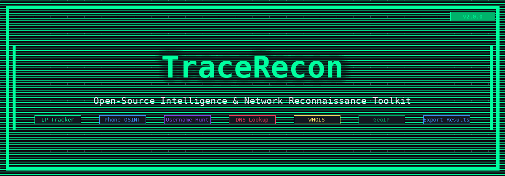
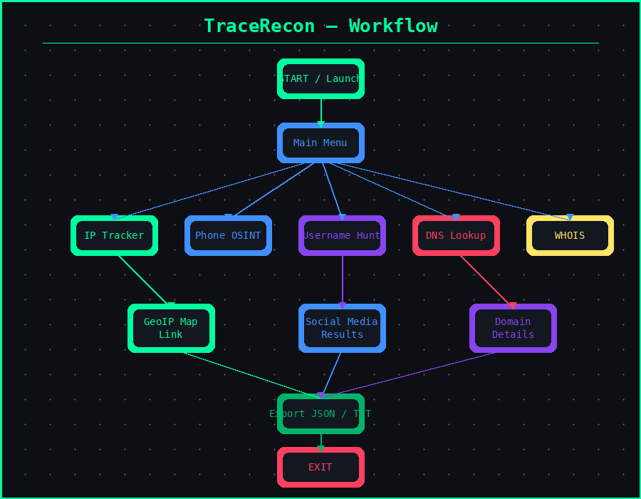

# TraceRecon

<p align="center">
  
</p>

<p align="center">
  
  
  
  
</p>

---

**TraceRecon** is an open-source, terminal-based OSINT and network reconnaissance toolkit written in Python. It consolidates the most common recon workflows into a single, clean, interactive CLI — designed for security researchers, CTF players, and network administrators.

> ⚠️ **Legal Notice:** Use TraceRecon only on systems and targets you own or have explicit written permission to investigate. Unauthorized use is illegal. See [SECURITY.md](SECURITY.md) for full details.

---

## Feature Overview

| # | Module | Description |
|---|--------|-------------|
| 1 | **IP Address Tracker** | Full geolocation, ISP, ASN, timezone, map link |
| 2 | **My Public IP** | Detect your own public-facing IP with ISP info |
| 3 | **Phone Number OSINT** | Carrier, region, format, timezone via phonenumbers |
| 4 | **Username Recon** | Threaded scan across 30+ social/dev platforms |
| 5 | **DNS Lookup** | A, AAAA, MX, NS, TXT, CNAME, SOA, SRV records |
| 6 | **WHOIS Lookup** | Registrar, dates, name servers, registrant info |
| 7 | **Reverse DNS (PTR)** | Hostname resolution + forward-confirm check |
| 8 | **Subnet / CIDR Calc** | Network/broadcast/host range, mask, IP version |
| 9 | **Port Scanner** | Threaded scan of 20 common ports with service IDs |
| ✦ | **Export Results** | Every module can export JSON + TXT to `output/` |

---

## Screenshots

<p align="center">
  
  
  
  
  
</p>

---

## Workflow

<p align="center">
  
</p>

```
┌─────────────────────────────────────────────────────────┐
│                  Launch tracerecon.py                   │
└─────────────────────────┬───────────────────────────────┘
                          │
              ┌───────────▼───────────┐
              │       Main Menu       │
              └──┬──┬──┬──┬──┬──┬────┘
                 │  │  │  │  │  │
    ┌────────────┘  │  │  │  │  └──────────────┐
    ▼               ▼  │  ▼  ▼                 ▼
 [1] IP          [3] Phone  [5] DNS      [8] Subnet
 Tracker         OSINT      Lookup       Calc
    │               │  │  │              │
    ▼               │  │  ▼              │
 GeoIP + ISP    Carrier  [6] WHOIS      Net range
 + Map link     Region   Registrar      + hosts
    │               │  │  │              │
    └───────────────┘  │  └──────────────┘
                       │
              ┌────────▼────────┐
              │ [4] Username    │
              │    Recon        │
              │ 30+ platforms   │
              │ (threaded)      │
              └────────┬────────┘
                       │
              ┌────────▼────────┐
              │  Export JSON    │ ← every module
              │  + TXT output/  │
              └────────┬────────┘
                       │
              ┌────────▼────────┐
              │      EXIT       │
              └─────────────────┘
```

---

## Installation

### Requirements
- Python 3.8 or higher
- pip

### Quick Start

```bash
# 1. Clone the repository
git clone https://github.com/PRATHAM777P/TraceRecon.git
cd TraceRecon

# 2. (Recommended) Create a virtual environment
python -m venv venv
source venv/bin/activate        # Linux / macOS
venv\Scripts\activate.bat       # Windows

# 3. Install dependencies
pip install -r requirements.txt

# 4. Run
python tracerecon.py
```

### Termux (Android)

```bash
pkg update && pkg upgrade
pkg install python git
git clone https://github.com/PRATHAM777P/TraceRecon.git
cd TraceRecon
pip install -r requirements.txt
python tracerecon.py
```

---

## Demo Usage

### Module 1 — IP Address Tracker

```
  [ ? ] Select option : 1

  Enter target IP (leave blank for auto-detect): 8.8.8.8

  ────────────────────────────────────────────────────
  RESULT — IP INFORMATION
  ────────────────────────────────────────────────────
  Target IP             : 8.8.8.8
  Type                  : IPv4
  Country               : United States 🇺🇸
  City                  : Mountain View
  Latitude              : 37.386
  Longitude             : -122.0838
  Google Maps           : https://maps.google.com/?q=37.386,-122.0838
  ISP                   : Google LLC
  ASN                   : 15169
  Timezone ID           : America/Los_Angeles
  Current Time          : 2025-01-01T10:30:00-08:00
  ────────────────────────────────────────────────────
  Export results? [y/N]: y
  [+] Results saved → ip_tracker_20250101_103000.json & .txt
```

---

### Module 3 — Phone Number OSINT

```
  [ ? ] Select option : 3

  Enter phone number [+countrycode number]: +14155552671

  ────────────────────────────────────────────────────
  RESULT — PHONE INFORMATION
  ────────────────────────────────────────────────────
  Input Number          : +14155552671
  E.164 Format          : +14155552671
  International         : +1 415-555-2671
  National Format       : (415) 555-2671
  Country Code          : +1
  Region                : US
  Location              : California
  Carrier/Operator      : (carrier data if available)
  Number Type           : Fixed Line
  Valid                 : True
  Timezone(s)           : America/Los_Angeles
  ────────────────────────────────────────────────────
```

---

### Module 4 — Username Recon

```
  [ ? ] Select option : 4

  Enter username to hunt: johndoe

  Scanning 30 platforms for 'johndoe' …
  ────────────────────────────────────────────────────
  [FOUND]   GitHub           → https://github.com/johndoe
  [FOUND]   Twitter/X        → https://x.com/johndoe
  [FOUND]   Reddit           → https://www.reddit.com/user/johndoe
  [---]     TikTok           → not found
  [---]     Snapchat         → not found
  ...
  ────────────────────────────────────────────────────
  RESULT — 3 MATCHES / 27 NOT FOUND
```

---

### Module 5 — DNS Lookup

```
  [ ? ] Select option : 5

  Enter domain (e.g. example.com): github.com

  [A    ] 140.82.121.4
  [AAAA ] — no record —
  [MX   ] 10 aspmx.l.google.com., 20 alt1.aspmx.l.google.com.
  [NS   ] ns1.p16.dynect.net., ns2.p16.dynect.net.
  [TXT  ] v=spf1 ip4:192.30.252.0/22 ...
  [SOA  ] ns1.p16.dynect.net. ...
```

---

### Module 8 — Subnet Calculator

```
  [ ? ] Select option : 8

  Enter IP/CIDR (e.g. 192.168.1.0/24): 10.0.0.0/8

  Network               : 10.0.0.0/8
  CIDR                  : /8
  Network Addr          : 10.0.0.0
  Broadcast             : 10.255.255.255
  Netmask               : 255.0.0.0
  Total Hosts           : 16777216
  Usable Hosts          : 16777214
  First Host            : 10.0.0.1
  Last Host             : 10.255.255.254
  Is Private            : True
```

---

## Output Files

Every module prompts you to export results. Files are saved to `output/`:

```
output/
├── ip_tracker_20250101_103000.json
├── ip_tracker_20250101_103000.txt
├── phone_osint_20250101_110000.json
├── username_recon_20250101_115000.json
└── ...
```

The `output/` directory is listed in `.gitignore` — your results are never accidentally committed.

---

## Project Structure

```
TraceRecon/
├── tracerecon.py        ← Main application
├── requirements.txt     ← Python dependencies
├── README.md            ← This file
├── SECURITY.md          ← Security policy & ethical use
├── .gitignore           ← Excludes output/, venv/, etc.
├── assets/
│   ├── banner.png       ← Project header banner
│   ├── workflow.png     ← Workflow diagram
│   ├── ip_icon.png      ← IP Tracker module icon
│   ├── phone_icon.png   ← Phone OSINT module icon
│   ├── user_icon.png    ← Username Recon module icon
│   ├── dns_icon.png     ← DNS Lookup module icon
│   └── whois_icon.png   ← WHOIS module icon
└── output/              ← Exported results (gitignored)
```

---

## APIs Used

| API | Purpose | Auth Required |
|-----|---------|--------------|
| [ipwho.is](https://ipwho.is) | IP geolocation & ISP data | No |
| [api.ipify.org](https://api.ipify.org) | Public IP detection | No |
| phonenumbers (lib) | Phone OSINT — offline | No |
| dnspython (lib) | DNS queries via system resolver | No |
| python-whois (lib) | WHOIS via WHOIS protocol | No |
| socket (stdlib) | Port scanning, PTR lookups | No |

All lookups are **read-only** and **outbound only**. No server-side component.

---

## Contributing

1. Fork the repository
2. Create a feature branch: `git checkout -b feature/new-module`
3. Commit changes: `git commit -m "feat: add new module"`
4. Push: `git push origin feature/new-module`
5. Open a Pull Request

Please read [SECURITY.md](SECURITY.md) before contributing.

---

## Roadmap

- [ ] Email header OSINT module
- [ ] Shodan integration (API key optional)
- [ ] GeoIP map rendering (ASCII map in terminal)
- [ ] CVE lookup by CPE string
- [ ] Passive subdomain enumeration
- [ ] JSON config file for API keys

---
### 🌟 Star this TraceRecon repo!

[](https://star-history.com/#PRATHAM777P/TraceRecon)

---

## Author

**Prathamesh Penshanwar**  
[]

---

<p align="center">
  Built for the security research community — use responsibly.
</p>
